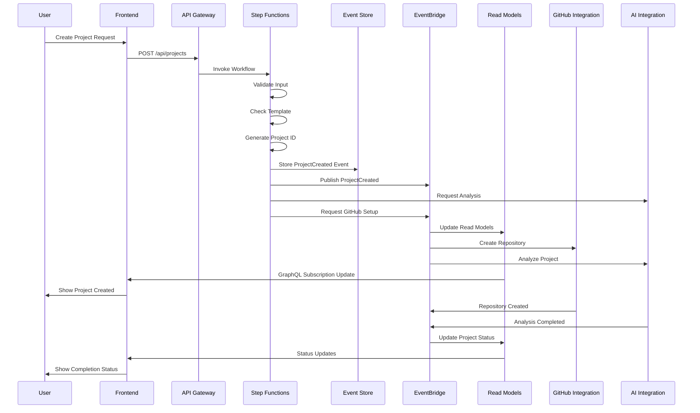

# Scenario: Create New Project

## Overview

This scenario describes the complete flow of creating a new scaffolded project from initial user request through to a working, deployed microservices application.

## Actors

- **User**: Developer or product manager creating a new project
- **System**: Skafu scaffolding application
- **External Services**: GitHub, Claude SDK, Template Management

## Prerequisites

- User is authenticated via Cognito
- User has permissions to create projects
- Base project templates are available
- GitHub integration is configured

## Main Flow

### 1. User Initiates Project Creation

**Frontend Action**:
```javascript
// Redux action dispatch
dispatch(createProject({
  name: "E-commerce Platform",
  description: "Modern e-commerce microservices platform",
  templateId: "full-stack-template-uuid",
  configuration: {
    framework: "sam",
    runtime: "python3.9",
    region: "us-east-1",
    environment: "development"
  }
}));
```

**API Gateway Request**:
```http
POST /api/projects
Authorization: Bearer {jwt-token}
Content-Type: application/json

{
  "name": "E-commerce Platform",
  "description": "Modern e-commerce microservices platform", 
  "templateId": "full-stack-template-uuid",
  "configuration": {
    "framework": "sam",
    "runtime": "python3.9",
    "region": "us-east-1",
    "environment": "development"
  },
  "correlationId": "req-12345-uuid"
}
```

### 2. API Gateway Validation

**Request Validation**:
- JSON schema validation (OpenAPI spec)
- JWT token validation
- Rate limiting check
- WAF security screening

### 3. Step Functions: Project Creation Workflow

```json
{
  "Comment": "Create Project Workflow",
  "StartAt": "ValidateInput",
  "States": {
    "ValidateInput": {
      "Type": "Task",
      "Resource": "arn:aws:states:::lambda:invoke",
      "Parameters": {
        "FunctionName": "validate-project-input",
        "Payload": {
          "projectData.$": "$",
          "userId.$": "$.requestContext.authorizer.claims.sub"
        }
      },
      "Next": "CheckTemplateCompatibility"
    },
    "CheckTemplateCompatibility": {
      "Type": "Task", 
      "Resource": "arn:aws:states:::lambda:invoke",
      "Parameters": {
        "FunctionName": "check-template-compatibility"
      },
      "Next": "GenerateProjectId"
    },
    "GenerateProjectId": {
      "Type": "Task",
      "Resource": "arn:aws:states:::lambda:invoke",
      "Parameters": {
        "FunctionName": "generate-project-id"
      },
      "ResultPath": "$.projectId",
      "Next": "StoreProjectCreatedEvent"
    },
    "StoreProjectCreatedEvent": {
      "Type": "Task",
      "Resource": "arn:aws:states:::dynamodb:putItem",
      "Parameters": {
        "TableName": "ProjectEvents",
        "Item": {
          "projectId": {"S.$": "$.projectId"},
          "eventSequence": {"N": "1"},
          "eventId": {"S.$": "States.UUID()"},
          "eventType": {"S": "ProjectCreated"},
          "eventData": {"S.$": "States.JsonToString($)"},
          "correlationId": {"S.$": "$.correlationId"},
          "timestamp": {"S.$": "$$.State.EnteredTime"},
          "userId": {"S.$": "$.userId"}
        }
      },
      "Next": "PublishProjectCreatedEvent"
    },
    "PublishProjectCreatedEvent": {
      "Type": "Task",
      "Resource": "arn:aws:states:::events:putEvents",
      "Parameters": {
        "Entries": [{
          "Source": "project-management",
          "DetailType": "ProjectCreated",
          "Detail": {
            "projectId.$": "$.projectId",
            "name.$": "$.name",
            "description.$": "$.description",
            "ownerId.$": "$.userId",
            "templateId.$": "$.templateId",
            "configuration.$": "$.configuration",
            "correlationId.$": "$.correlationId"
          }
        }]
      },
      "Next": "RequestAIAnalysis"
    },
    "RequestAIAnalysis": {
      "Type": "Task",
      "Resource": "arn:aws:states:::lambda:invoke",
      "Parameters": {
        "FunctionName": "request-ai-project-analysis",
        "Payload": {
          "projectId.$": "$.projectId",
          "description.$": "$.description",
          "templateId.$": "$.templateId"
        }
      },
      "Next": "InitiateGitHubSetup"
    },
    "InitiateGitHubSetup": {
      "Type": "Task",
      "Resource": "arn:aws:states:::events:putEvents",
      "Parameters": {
        "Entries": [{
          "Source": "project-management",
          "DetailType": "GitHubRepositoryRequested",
          "Detail": {
            "projectId.$": "$.projectId",
            "name.$": "$.name",
            "configuration.$": "$.configuration",
            "correlationId.$": "$.correlationId"
          }
        }]
      },
      "End": true
    }
  }
}
```

### 4. Event Processing and Read Model Updates

**ProjectCreated Event Consumers**:

**Read Model Update Lambda**:
```python
def handle_project_created(event, context):
    project_data = event['detail']
    
    # Update Project List View
    dynamodb.put_item(
        TableName='ProjectListView',
        Item={
            'organizationId': project_data['organizationId'],
            'projectId': project_data['projectId'],
            'name': project_data['name'],
            'description': project_data['description'],
            'status': 'DRAFT',
            'serviceCount': 0,
            'lastUpdated': datetime.utcnow().isoformat(),
            'tags': set()
        }
    )
    
    # Update Project Detail View
    dynamodb.put_item(
        TableName='ProjectDetailView',
        Item={
            'projectId': project_data['projectId'],
            'project': project_data,
            'services': [],
            'relationships': [],
            'topology': {},
            'metrics': {}
        }
    )
```

**GitHub Integration Event**:
- Repository creation initiated
- Branch protection rules applied
- Initial SAM template committed
- CI/CD pipeline configured

**AI Integration Event**:
- Project requirements analyzed
- Service boundary suggestions generated
- Architecture recommendations created

### 5. Frontend Real-time Updates

**GraphQL Subscription**:
```javascript
// Frontend subscription to project updates
const subscription = client.graphql({
  query: `
    subscription OnProjectCreated($userId: ID!) {
      onProjectCreated(ownerId: $userId) {
        projectId
        name
        description
        status
        createdAt
      }
    }
  `,
  variables: { userId: currentUser.id }
}).subscribe({
  next: (data) => {
    dispatch(addProject(data.onProjectCreated));
    showNotification('Project created successfully!');
  }
});
```

**Redux State Update**:
```javascript
// Project slice update
projectSlice.reducers.addProject = (state, action) => {
  state.list.push(action.payload);
  state.loading = false;
  state.error = null;
};
```

### 6. Asynchronous Completions

**GitHub Repository Creation**:
- Repository created with initial structure
- SAM template and basic configuration committed
- `RepositoryCreated` event published
- Project status updated to `ACTIVE`

**AI Analysis Completion**:
- Service recommendations generated
- Architecture suggestions provided
- `ProjectAnalysisCompleted` event published
- Recommendations shown in UI

## Event Flow Diagram



## Error Scenarios

### Template Not Found
```json
{
  "error": "TemplateNotFound",
  "message": "Template with ID template-uuid not found",
  "correlationId": "req-12345-uuid"
}
```
**Recovery**: User selects different template

### Name Conflict
```json
{
  "error": "ProjectNameExists", 
  "message": "Project name 'E-commerce Platform' already exists",
  "correlationId": "req-12345-uuid"
}
```
**Recovery**: User provides different name

### GitHub API Failure
- `GitHubRepositoryCreationFailed` event published to ErrorBus
- Project remains in `DRAFT` status
- User notified of partial completion
- Retry mechanism available

### AI Service Timeout
- `ProjectAnalysisTimeout` event published to ErrorBus
- Project creation continues without AI recommendations
- Analysis can be requested later manually

## Success Criteria

1. **Project Entity Created**: ProjectCreated event stored in event store
2. **Read Models Updated**: Project appears in user's project list
3. **Repository Created**: GitHub repository created with initial structure
4. **Status Active**: Project status updated to ACTIVE after repository creation
5. **AI Recommendations**: Service suggestions provided (within 30 seconds)
6. **User Notification**: Success confirmation shown in UI

## Performance Targets

- **API Response Time**: < 200ms (before async processing)
- **Project Visibility**: < 2 seconds (read model update)
- **Repository Creation**: < 30 seconds
- **AI Analysis**: < 60 seconds
- **Complete Flow**: < 90 seconds end-to-end

## Monitoring and Metrics

- Project creation success rate
- Template compatibility check failures  
- GitHub integration failures
- AI analysis completion rate
- End-to-end creation time
- User conversion rate (draft → active projects)