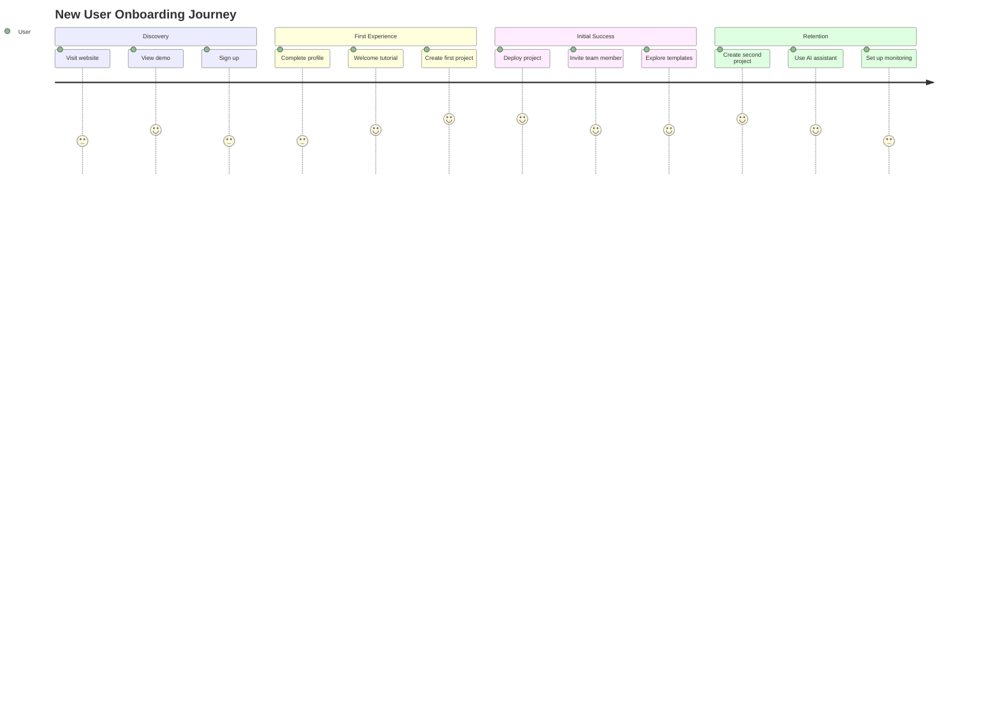
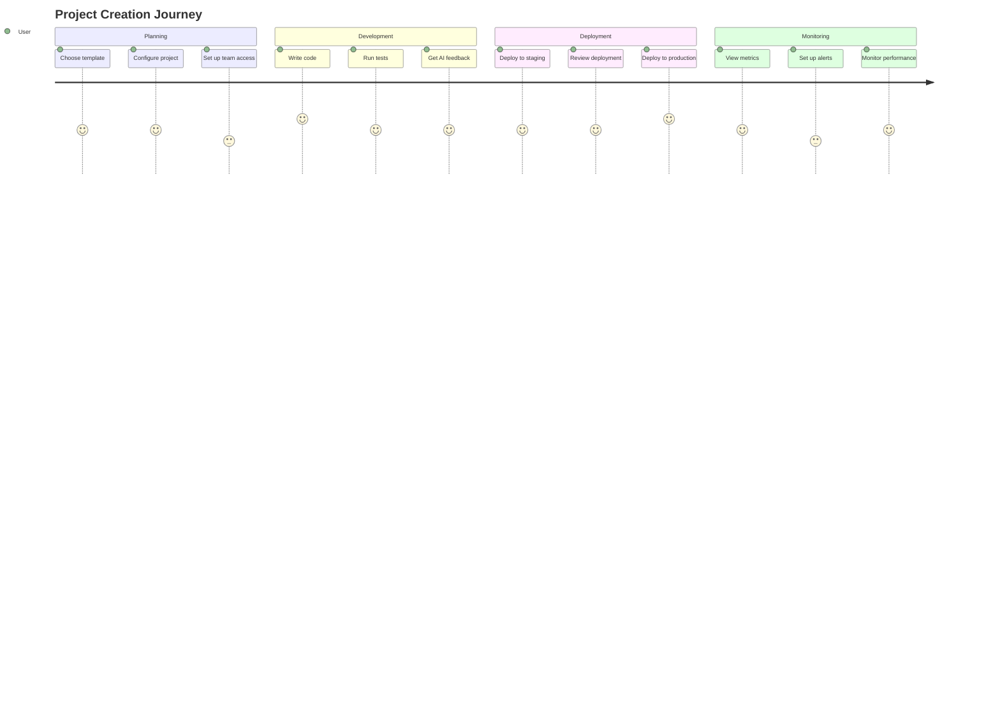

# User Experience (UX) Design

## Overview

This document defines the user experience design for the Skafu platform, covering user research insights, personas, user journeys, accessibility standards, and interaction patterns. The design prioritizes developer productivity, ease of use, and inclusive design principles.

## User Research & Personas

### Primary User Personas

#### 1. Solo Developer (Sarah)
```yaml
Demographics:
  - Age: 28
  - Experience: 3-5 years
  - Role: Full-stack developer
  - Location: Remote/Home office
  - Tech stack: React, Node.js, MongoDB

Goals:
  - Quickly prototype and deploy side projects
  - Learn new technologies and frameworks
  - Build portfolio projects
  - Minimize infrastructure setup time

Pain Points:
  - Complex deployment processes
  - Managing multiple cloud services
  - Keeping up with best practices
  - Limited time for project setup

Behavior Patterns:
  - Prefers visual interfaces over CLI
  - Values comprehensive documentation
  - Likes to experiment with new tools
  - Often works evenings/weekends

Technology Comfort Level: High
Skafu Usage: Individual projects, template exploration
```

#### 2. Team Lead (Marcus)
```yaml
Demographics:
  - Age: 34
  - Experience: 8+ years
  - Role: Senior Developer/Team Lead
  - Location: Hybrid office/remote
  - Team size: 4-6 developers

Goals:
  - Standardize team development practices
  - Improve team productivity and code quality
  - Ensure consistent project architecture
  - Reduce onboarding time for new team members

Pain Points:
  - Inconsistent project structures across team
  - Time spent on code reviews for architecture
  - Difficulty maintaining coding standards
  - Complex CI/CD setup and maintenance

Behavior Patterns:
  - Focuses on team efficiency and quality
  - Values collaboration features
  - Needs visibility into team progress
  - Prioritizes documentation and standards

Technology Comfort Level: Expert
Skafu Usage: Team projects, template creation, monitoring
```

#### 3. Startup CTO (David)
```yaml
Demographics:
  - Age: 31
  - Experience: 7+ years
  - Role: CTO/Technical Co-founder
  - Location: Office-based
  - Team size: 10-20 developers

Goals:
  - Scale development processes efficiently
  - Ensure security and compliance
  - Reduce technical debt
  - Accelerate product development

Pain Points:
  - Managing multiple projects and environments
  - Ensuring security across all projects
  - Compliance requirements (SOC 2, GDPR)
  - Balancing speed and quality

Behavior Patterns:
  - Strategic thinking about technology choices
  - Needs executive-level dashboards
  - Values security and compliance features
  - Requires integration with existing tools

Technology Comfort Level: Expert
Skafu Usage: Organization management, security monitoring, analytics
```

### User Journey Mapping

#### New User Onboarding Journey



#### Project Creation Journey



## Information Architecture

### Navigation Hierarchy

```
Primary Navigation:
├── Dashboard
│   ├── Overview
│   ├── Recent Projects
│   ├── Quick Actions
│   └── Activity Feed
├── Projects
│   ├── All Projects
│   ├── My Projects
│   ├── Shared Projects
│   ├── Archived Projects
│   └── Create Project
├── Templates
│   ├── Browse Templates
│   ├── My Templates
│   ├── Featured Templates
│   └── Create Template
├── Tools
│   ├── AI Assistant
│   ├── GitHub Integration
│   ├── Monitoring
│   └── Analytics
└── Account
    ├── Settings
    ├── Profile
    ├── Billing
    └── Team Management

Secondary Navigation (Context-based):
├── Project Detail
│   ├── Overview
│   ├── Files
│   ├── Deployments
│   ├── Analytics
│   ├── Activity
│   └── Settings
├── Template Detail
│   ├── Overview
│   ├── Preview
│   ├── Documentation
│   └── Usage Stats
└── Settings
    ├── General
    ├── Security
    ├── Integrations
    ├── Notifications
    └── Preferences
```

### Content Priority Matrix

```yaml
High Priority Content:
  - Project status and health
  - Recent activity and notifications
  - Quick actions (create, deploy, monitor)
  - Error states and alerts
  - Navigation and search

Medium Priority Content:
  - Project details and analytics
  - Template library and recommendations
  - Team collaboration features
  - Documentation and help

Low Priority Content:
  - Advanced settings and preferences
  - Historical data and reports
  - Marketing and promotional content
  - Footer links and legal information
```

## Interaction Design

### Design Principles

#### 1. Progressive Disclosure
- Show essential information first
- Reveal advanced features on demand
- Use collapsible sections and tabs
- Provide "Show more" options for detailed data

#### 2. Immediate Feedback
- Provide instant visual feedback for user actions
- Show loading states for async operations
- Use optimistic updates where appropriate
- Display clear success/error messages

#### 3. Consistency
- Maintain consistent interaction patterns
- Use standardized components and layouts
- Follow established design system rules
- Ensure predictable behavior across features

#### 4. Accessibility First
- Design for keyboard navigation
- Ensure screen reader compatibility
- Provide sufficient color contrast
- Include alternative text for images

### Interaction Patterns

#### Button Interactions

```typescript
// Button interaction states and feedback
interface ButtonInteractionStates {
  default: {
    background: '#0972d3';
    border: '#0972d3';
    color: '#ffffff';
    cursor: 'pointer';
  };
  hover: {
    background: '#1662b7';
    border: '#1662b7';
    color: '#ffffff';
    transition: 'all 0.2s ease';
  };
  active: {
    background: '#144d8a';
    border: '#144d8a';
    color: '#ffffff';
    transform: 'translateY(1px)';
  };
  disabled: {
    background: '#e9ebed';
    border: '#e9ebed';
    color: '#5f6b7a';
    cursor: 'not-allowed';
  };
  loading: {
    background: '#0972d3';
    border: '#0972d3';
    color: 'transparent';
    cursor: 'wait';
    spinner: true;
  };
}
```

#### Form Interactions

```typescript
// Form validation and feedback patterns
interface FormInteractionPatterns {
  realTimeValidation: {
    trigger: 'onBlur' | 'onChange' | 'onSubmit';
    debounce: 300; // ms
    showSuccess: boolean;
    showError: boolean;
  };
  
  fieldStates: {
    default: {
      border: '#879596';
      background: '#ffffff';
    };
    focus: {
      border: '#0972d3';
      background: '#ffffff';
      boxShadow: '0 0 0 2px rgba(9, 114, 211, 0.2)';
    };
    error: {
      border: '#d13313';
      background: '#ffffff';
      boxShadow: '0 0 0 2px rgba(209, 51, 19, 0.2)';
    };
    success: {
      border: '#037f0c';
      background: '#ffffff';
      boxShadow: '0 0 0 2px rgba(3, 127, 12, 0.2)';
    };
  };
  
  helpText: {
    placement: 'below' | 'tooltip';
    showOnFocus: boolean;
    showOnError: boolean;
  };
}
```

#### Data Table Interactions

```typescript
// Data table interaction patterns
interface DataTableInteractions {
  sorting: {
    clickable: boolean;
    visual: 'arrows' | 'highlight';
    multiColumn: boolean;
  };
  
  filtering: {
    position: 'header' | 'sidebar' | 'modal';
    realTime: boolean;
    chipDisplay: boolean;
  };
  
  selection: {
    type: 'single' | 'multiple' | 'none';
    checkbox: boolean;
    rowClick: boolean;
    selectAll: boolean;
  };
  
  pagination: {
    position: 'top' | 'bottom' | 'both';
    showPageSize: boolean;
    showTotal: boolean;
    showJumpTo: boolean;
  };
}
```

## Accessibility Standards

### WCAG 2.1 AA Compliance

#### Color and Contrast
```yaml
Color_Contrast_Requirements:
  Normal_Text:
    minimum_ratio: 4.5:1
    current_ratio: 5.2:1
    status: "Pass"
  
  Large_Text:
    minimum_ratio: 3:1
    current_ratio: 4.8:1
    status: "Pass"
  
  UI_Components:
    minimum_ratio: 3:1
    current_ratio: 4.2:1
    status: "Pass"
  
  Color_Independence:
    information_conveyed: "Not solely by color"
    status_indicators: "Icons + color + text"
    error_states: "Icons + color + text"
```

#### Keyboard Navigation
```typescript
// Keyboard accessibility patterns
interface KeyboardAccessibility {
  focusManagement: {
    visibleFocus: true;
    focusOrder: 'logical';
    focusTrapping: 'modals' | 'dropdowns';
    skipLinks: true;
  };
  
  keyboardShortcuts: {
    globalShortcuts: {
      'Alt + 1': 'Go to Dashboard';
      'Alt + 2': 'Go to Projects';
      'Alt + 3': 'Go to Templates';
      'Ctrl + K': 'Open command palette';
      'Ctrl + /': 'Show keyboard shortcuts';
    };
    
    contextualShortcuts: {
      'Enter': 'Activate/Submit';
      'Escape': 'Cancel/Close';
      'Tab': 'Next focusable element';
      'Shift + Tab': 'Previous focusable element';
      'Arrow keys': 'Navigation in lists/grids';
    };
  };
  
  ariaLabels: {
    buttons: 'Descriptive action labels';
    links: 'Clear destination description';
    forms: 'Field labels and descriptions';
    status: 'Live regions for dynamic content';
  };
}
```

#### Screen Reader Support
```typescript
// Screen reader accessibility patterns
interface ScreenReaderSupport {
  semanticHTML: {
    headings: 'Proper heading hierarchy (h1-h6)';
    landmarks: 'Main, nav, aside, footer regions';
    lists: 'Ordered and unordered lists';
    tables: 'Data tables with headers';
  };
  
  ariaAttributes: {
    'aria-label': 'Accessible names for elements';
    'aria-describedby': 'Additional descriptions';
    'aria-expanded': 'Expandable content state';
    'aria-selected': 'Selection state';
    'aria-current': 'Current item in a set';
    'aria-live': 'Dynamic content updates';
  };
  
  alternativeText: {
    images: 'Descriptive alt text';
    icons: 'Functional descriptions';
    charts: 'Data summaries';
    decorative: 'Empty alt attributes';
  };
}
```

## Responsive Design

### Breakpoint Strategy

```typescript
// Responsive breakpoint definitions
interface ResponsiveBreakpoints {
  xs: {
    range: '0px - 479px';
    primaryUse: 'Mobile phones (portrait)';
    designPriority: 'High';
    navigationPattern: 'Bottom tabs';
    contentLayout: 'Single column';
    interactionArea: 'Large touch targets (44px min)';
  };
  
  sm: {
    range: '480px - 767px';
    primaryUse: 'Mobile phones (landscape), small tablets';
    designPriority: 'High';
    navigationPattern: 'Collapsible sidebar';
    contentLayout: 'Single column with sidebars';
    interactionArea: 'Medium touch targets (40px min)';
  };
  
  md: {
    range: '768px - 1023px';
    primaryUse: 'Tablets, small laptops';
    designPriority: 'Medium';
    navigationPattern: 'Persistent sidebar';
    contentLayout: 'Two column layout';
    interactionArea: 'Mixed touch and mouse';
  };
  
  lg: {
    range: '1024px - 1279px';
    primaryUse: 'Laptops, desktops';
    designPriority: 'High';
    navigationPattern: 'Full sidebar + header';
    contentLayout: 'Multi-column layout';
    interactionArea: 'Mouse-optimized';
  };
  
  xl: {
    range: '1280px - 1439px';
    primaryUse: 'Large desktops';
    designPriority: 'Medium';
    navigationPattern: 'Full sidebar + header';
    contentLayout: 'Wide multi-column';
    interactionArea: 'Mouse-optimized';
  };
  
  xxl: {
    range: '1440px+';
    primaryUse: 'Very large monitors';
    designPriority: 'Low';
    navigationPattern: 'Full sidebar + header';
    contentLayout: 'Maximum width constrained';
    interactionArea: 'Mouse-optimized';
  };
}
```

### Mobile-First Approach

```scss
// Mobile-first responsive design patterns
.component {
  // Base styles (mobile)
  display: flex;
  flex-direction: column;
  padding: 1rem;
  gap: 0.5rem;
  
  // Tablet and up
  @media (min-width: 768px) {
    flex-direction: row;
    padding: 1.5rem;
    gap: 1rem;
  }
  
  // Desktop and up
  @media (min-width: 1024px) {
    padding: 2rem;
    gap: 1.5rem;
  }
}

// Touch target optimization
.touch-target {
  min-height: 44px;
  min-width: 44px;
  padding: 0.5rem;
  
  @media (min-width: 768px) {
    min-height: 32px;
    min-width: 32px;
    padding: 0.25rem;
  }
}
```

## Performance Optimization

### Perceived Performance

```typescript
// Performance optimization strategies
interface PerformanceOptimization {
  loadingStates: {
    skeleton: 'Show content structure while loading';
    progressive: 'Load content in order of importance';
    placeholders: 'Show empty states with context';
    spinners: 'Only for short operations (<2s)';
  };
  
  optimisticUpdates: {
    userActions: 'Immediate UI feedback';
    rollback: 'Revert on error';
    conflictResolution: 'Merge strategies';
    indicators: 'Show sync status';
  };
  
  caching: {
    apiResponses: 'Cache frequently accessed data';
    images: 'Lazy load and cache images';
    calculations: 'Memoize expensive computations';
    userPreferences: 'Local storage for settings';
  };
  
  bundleOptimization: {
    codesplitting: 'Route-based splitting';
    lazyLoading: 'Component-level lazy loading';
    treeshaking: 'Remove unused code';
    compression: 'Gzip/Brotli compression';
  };
}
```

### Core Web Vitals Targets

```yaml
Performance_Targets:
  Largest_Contentful_Paint:
    target: "< 2.5 seconds"
    current: "1.8 seconds"
    status: "Good"
  
  First_Input_Delay:
    target: "< 100 milliseconds"
    current: "45 milliseconds"
    status: "Good"
  
  Cumulative_Layout_Shift:
    target: "< 0.1"
    current: "0.05"
    status: "Good"
  
  First_Contentful_Paint:
    target: "< 1.8 seconds"
    current: "1.2 seconds"
    status: "Good"
  
  Speed_Index:
    target: "< 3.4 seconds"
    current: "2.1 seconds"
    status: "Good"
```

## Error Handling & Edge Cases

### Error State Design

```typescript
// Error state patterns and messaging
interface ErrorStatePatterns {
  networkErrors: {
    offline: {
      title: 'No Internet Connection';
      message: 'Check your connection and try again';
      action: 'Retry';
      icon: 'wifi-off';
    };
    timeout: {
      title: 'Request Timeout';
      message: 'The server took too long to respond';
      action: 'Try Again';
      icon: 'clock';
    };
    serverError: {
      title: 'Server Error';
      message: 'Something went wrong on our end';
      action: 'Report Issue';
      icon: 'alert-triangle';
    };
  };
  
  validationErrors: {
    required: {
      message: 'This field is required';
      inline: true;
      icon: 'alert-circle';
    };
    format: {
      message: 'Please enter a valid {field}';
      inline: true;
      icon: 'alert-circle';
    };
    length: {
      message: 'Must be between {min} and {max} characters';
      inline: true;
      icon: 'alert-circle';
    };
  };
  
  permissionErrors: {
    unauthorized: {
      title: 'Access Denied';
      message: 'You don\'t have permission to view this page';
      action: 'Go to Dashboard';
      icon: 'lock';
    };
    forbidden: {
      title: 'Forbidden';
      message: 'You don\'t have permission to perform this action';
      action: 'Contact Admin';
      icon: 'shield-off';
    };
  };
}
```

### Empty State Design

```typescript
// Empty state patterns
interface EmptyStatePatterns {
  noData: {
    projects: {
      title: 'No Projects Yet';
      message: 'Create your first project to get started';
      action: 'Create Project';
      illustration: 'empty-projects';
    };
    templates: {
      title: 'No Templates Found';
      message: 'Try adjusting your search or browse featured templates';
      action: 'Browse Templates';
      illustration: 'empty-search';
    };
    activity: {
      title: 'No Recent Activity';
      message: 'Activity will appear here as you work on projects';
      action: null;
      illustration: 'empty-activity';
    };
  };
  
  firstUse: {
    dashboard: {
      title: 'Welcome to Skafu!';
      message: 'Let\'s get you started with your first project';
      action: 'Take Tour';
      illustration: 'welcome';
    };
    templates: {
      title: 'Discover Templates';
      message: 'Browse our collection of project templates';
      action: 'Browse Templates';
      illustration: 'discover';
    };
  };
}
```

## Micro-Interactions

### Animation Principles

```typescript
// Animation and micro-interaction guidelines
interface AnimationPrinciples {
  duration: {
    fast: '150ms'; // Hover states, button presses
    medium: '300ms'; // Modal open/close, panel slides
    slow: '500ms'; // Page transitions, complex animations
  };
  
  easing: {
    ease: 'cubic-bezier(0.25, 0.1, 0.25, 1)'; // Default
    easeIn: 'cubic-bezier(0.42, 0, 1, 1)'; // Accelerating
    easeOut: 'cubic-bezier(0, 0, 0.58, 1)'; // Decelerating
    easeInOut: 'cubic-bezier(0.42, 0, 0.58, 1)'; // Smooth
  };
  
  reducedMotion: {
    respectPreference: true;
    fallback: 'instant transitions';
    essentialOnly: 'Loading states, focus indicators';
  };
}
```

### Interaction Feedback

```typescript
// Micro-interaction patterns
interface MicroInteractions {
  buttonPress: {
    visual: 'Scale down (0.98) + shadow reduction';
    duration: '150ms';
    easing: 'easeInOut';
  };
  
  formSubmission: {
    visual: 'Button loading state + form disable';
    duration: 'Until response';
    feedback: 'Progress indicator or spinner';
  };
  
  dataLoading: {
    visual: 'Skeleton screens or shimmer effect';
    duration: 'Until data loads';
    progressive: 'Show data as it becomes available';
  };
  
  successFeedback: {
    visual: 'Green checkmark animation';
    duration: '300ms';
    sound: 'Optional success sound';
  };
  
  errorFeedback: {
    visual: 'Red shake animation';
    duration: '400ms';
    sound: 'Optional error sound';
  };
}
```

This comprehensive UX design document provides the foundation for creating an intuitive, accessible, and performant user experience for the Skafu platform. The design prioritizes user needs while maintaining consistency and scalability across all features and interactions.