# CQRS Data Flow Architecture

## Overview

This document describes the Command Query Responsibility Segregation (CQRS) data flow architecture implemented in the Skafu microservices scaffolding application, showing how commands and queries are separated and how data flows through the system.

## CQRS Pattern Implementation

### Command and Query Separation

```
┌─────────────────────────────────────────────────────────────────────────────┐
│                              CQRS Architecture                               │
├─────────────────────────────────────────────────────────────────────────────┤
│                                                                             │
│  Command Side (Write)                    Query Side (Read)                  │
│  ─────────────────────                   ────────────────────               │
│                                                                             │
│  ┌─────────────────┐                    ┌─────────────────┐                │
│  │   REST API      │                    │   GraphQL API   │                │
│  │   Commands      │                    │   Queries       │                │
│  └─────────────────┘                    └─────────────────┘                │
│           │                                       │                         │
│           ▼                                       ▼                         │
│  ┌─────────────────┐                    ┌─────────────────┐                │
│  │ Step Functions  │                    │ Amplify DataStore│                │
│  │   Workflows     │                    │   Read Models   │                │
│  └─────────────────┘                    └─────────────────┘                │
│           │                                       │                         │
│           ▼                                       ▼                         │
│  ┌─────────────────┐                    ┌─────────────────┐                │
│  │ Command Handlers│                    │ Query Handlers  │                │
│  │   (Lambda)      │                    │   (Resolvers)   │                │
│  └─────────────────┘                    └─────────────────┘                │
│           │                                       │                         │
│           ▼                                       ▼                         │
│  ┌─────────────────┐                    ┌─────────────────┐                │
│  │   Event Store   │                    │   React UI      │                │
│  │   (DynamoDB)    │                    │   Components    │                │
│  └─────────────────┘                    └─────────────────┘                │
│           │                                                                 │
│           ▼                                                                 │
│  ┌─────────────────┐                                                       │
│  │  EventBridge    │───────────────────────────────────────────────────────┤
│  │  Event Bus      │                                                       │
│  └─────────────────┘                                                       │
│                                                                             │
└─────────────────────────────────────────────────────────────────────────────┘
```

## Command Side Data Flow

### Command Processing Pipeline

```mermaid
graph TD
    User[👤 User Action]
    API[🚪 API Gateway]
    Validate[✅ Request Validation]
    SF[⚙️ Step Functions]
    Handler[🔧 Command Handler]
    Events[📝 Event Store]
    Publish[📡 EventBridge]
    
    User --> API
    API --> Validate
    Validate --> SF
    SF --> Handler
    Handler --> Events
    Events --> Publish
    
    subgraph "Command Validation"
        Validate --> Schema[Schema Validation]
        Validate --> Auth[Authorization]
        Validate --> Rate[Rate Limiting]
    end
    
    subgraph "Event Store"
        Events --> Persist[Persist Events]
        Events --> Aggregate[Update Aggregate]
        Events --> Version[Version Control]
    end
    
    subgraph "Event Publication"
        Publish --> Bus[EventBridge Bus]
        Publish --> Error[Error Bus]
        Publish --> Metrics[Metrics]
    end
```



### Command Types and Data Flow

#### Project Commands

```typescript
interface CreateProjectCommand {
  commandId: string;
  userId: string;
  correlationId: string;
  timestamp: string;
  data: {
    name: string;
    description: string;
    templateId: string;
    configuration: ProjectConfiguration;
  };
}

interface ProjectConfiguration {
  runtime: 'python3.9' | 'nodejs18';
  region: string;
  features: string[];
  environment: {
    [key: string]: string;
  };
}
```

#### Command Processing Flow

```
1. User submits CreateProject command
2. API Gateway validates request schema
3. Step Functions orchestrates command processing
4. Command Handler processes business logic
5. Events are persisted to DynamoDB
6. Events are published to EventBridge
7. Query side projections are updated
```

## Query Side Data Flow

### Query Processing Pipeline

```mermaid
graph TD
    Frontend[🌐 Frontend Request]
    GraphQL[📊 GraphQL API]
    Resolver[🔍 Query Resolver]
    DataStore[💾 Amplify DataStore]
    Cache[⚡ Cache Layer]
    Response[📤 Response]
    
    Frontend --> GraphQL
    GraphQL --> Resolver
    Resolver --> DataStore
    DataStore --> Cache
    Cache --> Response
    Response --> Frontend
    
    subgraph "Query Optimization"
        Resolver --> Batch[Batch Loading]
        Resolver --> Paginate[Pagination]
        Resolver --> Filter[Filtering]
    end
    
    subgraph "Data Sources"
        DataStore --> Primary[Primary Data]
        DataStore --> Derived[Derived Views]
        DataStore --> Aggregated[Aggregated Data]
    end
    
    subgraph "Caching Strategy"
        Cache --> Memory[In-Memory]
        Cache --> Redis[Redis Cache]
        Cache --> CDN[CDN Cache]
    end
```



### Query Types and Data Flow

#### Project Queries

```graphql
type Query {
  project(id: ID!): Project
  projects(filter: ProjectFilter, limit: Int, nextToken: String): ProjectConnection
  projectsByUser(userId: ID!, limit: Int, nextToken: String): ProjectConnection
  projectAnalytics(projectId: ID!, timeRange: TimeRange): ProjectAnalytics
}

type Project {
  id: ID!
  name: String!
  description: String
  status: ProjectStatus!
  templateId: String!
  configuration: ProjectConfiguration
  createdAt: AWSDateTime!
  updatedAt: AWSDateTime!
  deployments: [Deployment]
  analytics: ProjectAnalytics
}
```

#### Query Processing Flow

```
1. Frontend requests project data via GraphQL
2. Amplify resolvers handle query processing
3. DataStore retrieves data from read models
4. Cache layer optimizes frequently accessed data
5. Response is returned to frontend
6. Frontend updates UI components
```

## Event Sourcing Data Flow

### Event Store Architecture


### Event Store Schema

```json
{
  "PK": "PROJECT#123",
  "SK": "EVENT#2025-01-18T10:30:00.123Z#001",
  "eventId": "evt-12345",
  "eventType": "ProjectCreated",
  "eventVersion": "1.0",
  "timestamp": "2025-01-18T10:30:00.123Z",
  "correlationId": "req-12345",
  "causationId": "cmd-12345",
  "aggregateId": "PROJECT#123",
  "aggregateVersion": 1,
  "data": {
    "name": "E-commerce Platform",
    "description": "Full-stack e-commerce solution",
    "templateId": "full-stack-template",
    "configuration": {
      "runtime": "python3.9",
      "region": "us-east-1"
    }
  },
  "metadata": {
    "userId": "user-123",
    "sourceIp": "192.168.1.1",
    "userAgent": "Mozilla/5.0..."
  }
}
```

### Event Replay and Projection


## Cross-Domain Data Flow

### Domain Integration Pattern


### Saga Pattern Implementation

```typescript
// Project Creation Saga
class ProjectCreationSaga {
  async execute(command: CreateProjectCommand): Promise<void> {
    const correlationId = command.correlationId;
    
    try {
      // Step 1: Create project
      const projectCreated = await this.createProject(command);
      
      // Step 2: Select template
      const templateSelected = await this.selectTemplate(
        projectCreated.templateId,
        correlationId
      );
      
      // Step 3: Request AI analysis
      const aiAnalysis = await this.requestAIAnalysis(
        projectCreated.id,
        correlationId
      );
      
      // Step 4: Create repository
      const repository = await this.createRepository(
        projectCreated.id,
        correlationId
      );
      
      // Step 5: Configure project
      await this.configureProject(
        projectCreated.id,
        { templateSelected, aiAnalysis, repository },
        correlationId
      );
      
    } catch (error) {
      // Compensation logic
      await this.compensate(command, error);
    }
  }
}
```

## Data Consistency Patterns

### Eventual Consistency Model

```
Command → Event → Projection Update → Query Consistency
   ↓         ↓            ↓               ↓
 Immediate  ~100ms      ~500ms         ~1s
```

### Consistency Guarantees

1. **Strong Consistency**: Within single aggregate
2. **Eventual Consistency**: Across aggregates
3. **Causal Consistency**: Related events ordered
4. **Session Consistency**: User sees own writes

### Conflict Resolution

```typescript
interface ConflictResolution {
  strategy: 'last-write-wins' | 'merge' | 'reject';
  resolver: (conflicts: Conflict[]) => Resolution;
}

class EventConflictResolver {
  resolve(events: Event[]): Event[] {
    // Implement conflict resolution logic
    return events.sort((a, b) => 
      a.timestamp.localeCompare(b.timestamp)
    );
  }
}
```

## Performance Optimization

### Read Model Optimization

```typescript
// Optimized read models
interface ProjectReadModel {
  id: string;
  name: string;
  status: ProjectStatus;
  // Denormalized data for fast queries
  templateName: string;
  userEmail: string;
  deploymentCount: number;
  lastDeployedAt: string;
  // Aggregated metrics
  totalEvents: number;
  successRate: number;
}
```

### Caching Strategy


## Monitoring and Observability

### Data Flow Metrics

```yaml
Command Side Metrics:
  - Command processing latency
  - Event persistence rate
  - Aggregate version conflicts
  - Command failure rate

Query Side Metrics:
  - Query response time
  - Cache hit ratio
  - Projection update latency
  - Data staleness

Cross-Domain Metrics:
  - Event propagation latency
  - Saga completion rate
  - Consistency lag
  - Conflict resolution rate
```

### Tracing Data Flow


This CQRS data flow architecture ensures scalable, maintainable, and performant data processing while maintaining strong consistency within aggregates and eventual consistency across the system.