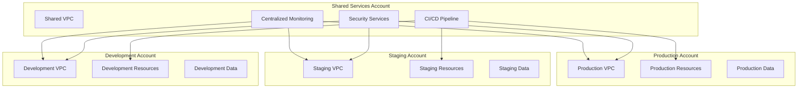
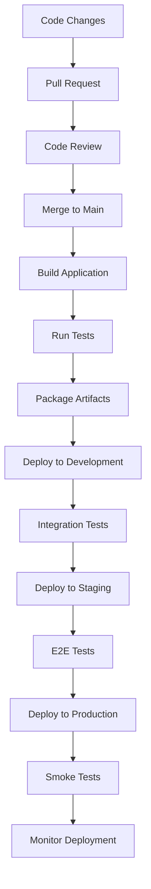

# Deployment Architecture

## Overview

This document describes the complete deployment architecture for the Skafu microservices scaffolding application, including infrastructure design, environment strategies, and deployment patterns.

## Infrastructure Overview

### High-Level Deployment Architecture

```
┌─────────────────────────────────────────────────────────────────────────────┐
│                            AWS Cloud Infrastructure                          │
├─────────────────────────────────────────────────────────────────────────────┤
│                                                                             │
│  ┌─────────────────────────────────────────────────────────────────────────┤
│  │                          Global Resources                               │
│  │                                                                         │
│  │  ┌─────────────┐ ┌─────────────┐ ┌─────────────┐ ┌─────────────┐      │
│  │  │     IAM     │ │    Route53  │ │ Certificate │ │    ACM      │      │
│  │  │   Roles     │ │     DNS     │ │   Manager   │ │   Certs     │      │
│  │  └─────────────┘ └─────────────┘ └─────────────┘ └─────────────┘      │
│  └─────────────────────────────────────────────────────────────────────────┤
│                                                                             │
│  ┌─────────────────────────────────────────────────────────────────────────┤
│  │                        Regional Resources                               │
│  │                                                                         │
│  │  ┌─────────────────────────────────────────────────────────────────────┤
│  │  │                     Application Layer                              │
│  │  │                                                                     │
│  │  │  ┌─────────────┐ ┌─────────────┐ ┌─────────────┐                  │
│  │  │  │  Frontend   │ │  API Gateway│ │ EventBridge │                  │
│  │  │  │  (Amplify)  │ │   (REST)    │ │   (Events)  │                  │
│  │  │  └─────────────┘ └─────────────┘ └─────────────┘                  │
│  │  └─────────────────────────────────────────────────────────────────────┤
│  │  │                                                                     │
│  │  │  ┌─────────────────────────────────────────────────────────────────┤
│  │  │  │                   Compute Layer                                 │
│  │  │  │                                                                 │
│  │  │  │  ┌─────────────┐ ┌─────────────┐ ┌─────────────┐              │
│  │  │  │  │   Lambda    │ │    Step     │ │   Lambda    │              │
│  │  │  │  │ Functions   │ │ Functions   │ │   Layers    │              │
│  │  │  │  └─────────────┘ └─────────────┘ └─────────────┘              │
│  │  │  └─────────────────────────────────────────────────────────────────┤
│  │  │                                                                     │
│  │  │  ┌─────────────────────────────────────────────────────────────────┤
│  │  │  │                    Data Layer                                   │
│  │  │  │                                                                 │
│  │  │  │  ┌─────────────┐ ┌─────────────┐ ┌─────────────┐              │
│  │  │  │  │  DynamoDB   │ │     S3      │ │   Secrets   │              │
│  │  │  │  │             │ │   Buckets   │ │   Manager   │              │
│  │  │  │  └─────────────┘ └─────────────┘ └─────────────┘              │
│  │  │  └─────────────────────────────────────────────────────────────────┤
│  │  │                                                                     │
│  │  │  ┌─────────────────────────────────────────────────────────────────┤
│  │  │  │                 Monitoring Layer                                │
│  │  │  │                                                                 │
│  │  │  │  ┌─────────────┐ ┌─────────────┐ ┌─────────────┐              │
│  │  │  │  │ CloudWatch  │ │    X-Ray    │ │  GuardDuty  │              │
│  │  │  │  │             │ │   Tracing   │ │   Security  │              │
│  │  │  │  └─────────────┘ └─────────────┘ └─────────────┘              │
│  │  │  └─────────────────────────────────────────────────────────────────┤
│  │  └─────────────────────────────────────────────────────────────────────┤
│  └─────────────────────────────────────────────────────────────────────────┤
│                                                                             │
└─────────────────────────────────────────────────────────────────────────────┘
```

## SAM Template Structure

### Master Template Architecture

```yaml
# template.yaml - Master template
AWSTemplateFormatVersion: '2010-09-09'
Transform: AWS::Serverless-2016-10-31
Description: 'Skafu Microservices Scaffolding Application'

Parameters:
  Environment:
    Type: String
    Default: development
    AllowedValues: [development, staging, production]
  
  Version:
    Type: String
    Description: Application version
    Default: latest

Globals:
  Function:
    Timeout: 30
    MemorySize: 256
    Runtime: python3.9
    Environment:
      Variables:
        ENVIRONMENT: !Ref Environment
        VERSION: !Ref Version
        POWERTOOLS_SERVICE_NAME: skafu
        POWERTOOLS_METRICS_NAMESPACE: Skafu
        LOG_LEVEL: !If [IsProduction, INFO, DEBUG]

Conditions:
  IsProduction: !Equals [!Ref Environment, production]
  IsStaging: !Equals [!Ref Environment, staging]
  IsDevelopment: !Equals [!Ref Environment, development]

Resources:
  # Global Resources
  GlobalResourcesStack:
    Type: AWS::CloudFormation::Stack
    Properties:
      TemplateURL: !Sub '${TemplatesBucket}/global-resources.yaml'
      Parameters:
        Environment: !Ref Environment
        Version: !Ref Version

  # Domain Stacks
  ProjectManagementStack:
    Type: AWS::CloudFormation::Stack
    Properties:
      TemplateURL: !Sub '${TemplatesBucket}/domains/project-management.yaml'
      Parameters:
        Environment: !Ref Environment
        EventBusArn: !GetAtt GlobalResourcesStack.Outputs.EventBusArn
        ErrorBusArn: !GetAtt GlobalResourcesStack.Outputs.ErrorBusArn
        
  TemplateManagementStack:
    Type: AWS::CloudFormation::Stack
    Properties:
      TemplateURL: !Sub '${TemplatesBucket}/domains/template-management.yaml'
      Parameters:
        Environment: !Ref Environment
        EventBusArn: !GetAtt GlobalResourcesStack.Outputs.EventBusArn
        TemplatesBucket: !GetAtt GlobalResourcesStack.Outputs.TemplatesBucket

  AIIntegrationStack:
    Type: AWS::CloudFormation::Stack
    Properties:
      TemplateURL: !Sub '${TemplatesBucket}/domains/ai-integration.yaml'
      Parameters:
        Environment: !Ref Environment
        EventBusArn: !GetAtt GlobalResourcesStack.Outputs.EventBusArn
        ClaudeApiKeyArn: !GetAtt GlobalResourcesStack.Outputs.ClaudeApiKeyArn

  GitHubIntegrationStack:
    Type: AWS::CloudFormation::Stack
    Properties:
      TemplateURL: !Sub '${TemplatesBucket}/domains/github-integration.yaml'
      Parameters:
        Environment: !Ref Environment
        EventBusArn: !GetAtt GlobalResourcesStack.Outputs.EventBusArn
        GitHubTokenArn: !GetAtt GlobalResourcesStack.Outputs.GitHubTokenArn

  ObservabilityStack:
    Type: AWS::CloudFormation::Stack
    Properties:
      TemplateURL: !Sub '${TemplatesBucket}/domains/observability.yaml'
      Parameters:
        Environment: !Ref Environment
        ErrorBusArn: !GetAtt GlobalResourcesStack.Outputs.ErrorBusArn

  # Frontend Stack
  FrontendStack:
    Type: AWS::CloudFormation::Stack
    Properties:
      TemplateURL: !Sub '${TemplatesBucket}/frontend.yaml'
      Parameters:
        Environment: !Ref Environment
        ApiGatewayUrl: !GetAtt ProjectManagementStack.Outputs.ApiGatewayUrl
        GraphQLApiUrl: !GetAtt ProjectManagementStack.Outputs.GraphQLApiUrl

Outputs:
  ApplicationUrl:
    Description: Application URL
    Value: !GetAtt FrontendStack.Outputs.ApplicationUrl
    Export:
      Name: !Sub '${AWS::StackName}-ApplicationUrl'
      
  ApiGatewayUrl:
    Description: API Gateway URL
    Value: !GetAtt ProjectManagementStack.Outputs.ApiGatewayUrl
    Export:
      Name: !Sub '${AWS::StackName}-ApiGatewayUrl'
```

### Global Resources Template

```yaml
# global-resources.yaml
AWSTemplateFormatVersion: '2010-09-09'
Transform: AWS::Serverless-2016-10-31
Description: 'Global shared resources for Skafu application'

Parameters:
  Environment:
    Type: String
  Version:
    Type: String

Resources:
  # EventBridge Bus
  EventBus:
    Type: AWS::Events::EventBus
    Properties:
      Name: !Sub '${AWS::StackName}-event-bus'
      EventSourceName: !Sub 'skafu-${Environment}'

  # Error Bus
  ErrorBus:
    Type: AWS::Events::EventBus
    Properties:
      Name: !Sub '${AWS::StackName}-error-bus'
      EventSourceName: !Sub 'skafu-error-${Environment}'

  # S3 Buckets
  TemplatesBucket:
    Type: AWS::S3::Bucket
    Properties:
      BucketName: !Sub 'skafu-templates-${Environment}-${AWS::AccountId}'
      VersioningConfiguration:
        Status: Enabled
      BucketEncryption:
        ServerSideEncryptionConfiguration:
          - ServerSideEncryptionByDefault:
              SSEAlgorithm: AES256
      PublicAccessBlockConfiguration:
        BlockPublicAcls: true
        BlockPublicPolicy: true
        IgnorePublicAcls: true
        RestrictPublicBuckets: true

  ArtifactsBucket:
    Type: AWS::S3::Bucket
    Properties:
      BucketName: !Sub 'skafu-artifacts-${Environment}-${AWS::AccountId}'
      LifecycleConfiguration:
        Rules:
          - Id: DeleteOldArtifacts
            Status: Enabled
            ExpirationInDays: 30

  # Cognito User Pool
  UserPool:
    Type: AWS::Cognito::UserPool
    Properties:
      UserPoolName: !Sub 'skafu-users-${Environment}'
      UsernameAttributes:
        - email
      AutoVerifiedAttributes:
        - email
      Schema:
        - Name: email
          AttributeDataType: String
          Mutable: true
          Required: true

  UserPoolClient:
    Type: AWS::Cognito::UserPoolClient
    Properties:
      ClientName: !Sub 'skafu-client-${Environment}'
      UserPoolId: !Ref UserPool
      GenerateSecret: false
      ExplicitAuthFlows:
        - ALLOW_USER_SRP_AUTH
        - ALLOW_REFRESH_TOKEN_AUTH

  # Secrets Manager
  ClaudeApiKey:
    Type: AWS::SecretsManager::Secret
    Properties:
      Name: !Sub '/skafu/${Environment}/claude-api-key'
      Description: 'Claude API Key for AI integration'
      SecretString: !Sub |
        {
          "apiKey": "CHANGE_ME"
        }

  GitHubToken:
    Type: AWS::SecretsManager::Secret
    Properties:
      Name: !Sub '/skafu/${Environment}/github-token'
      Description: 'GitHub Personal Access Token'
      SecretString: !Sub |
        {
          "token": "CHANGE_ME"
        }

  # Lambda Layers
  SharedLayer:
    Type: AWS::Serverless::LayerVersion
    Properties:
      LayerName: !Sub 'skafu-shared-${Environment}'
      Description: 'Shared utilities and dependencies'
      ContentUri: layers/shared/
      CompatibleRuntimes:
        - python3.9
      RetentionPolicy: Delete

  ClaudeSdkLayer:
    Type: AWS::Serverless::LayerVersion
    Properties:
      LayerName: !Sub 'skafu-claude-sdk-${Environment}'
      Description: 'Claude SDK for AI integration'
      ContentUri: layers/claude-sdk/
      CompatibleRuntimes:
        - python3.9
      RetentionPolicy: Delete

Outputs:
  EventBusArn:
    Description: EventBridge Bus ARN
    Value: !GetAtt EventBus.Arn
    Export:
      Name: !Sub '${AWS::StackName}-EventBusArn'

  ErrorBusArn:
    Description: Error Bus ARN
    Value: !GetAtt ErrorBus.Arn
    Export:
      Name: !Sub '${AWS::StackName}-ErrorBusArn'

  TemplatesBucket:
    Description: Templates S3 Bucket
    Value: !Ref TemplatesBucket
    Export:
      Name: !Sub '${AWS::StackName}-TemplatesBucket'

  UserPoolId:
    Description: Cognito User Pool ID
    Value: !Ref UserPool
    Export:
      Name: !Sub '${AWS::StackName}-UserPoolId'

  UserPoolClientId:
    Description: Cognito User Pool Client ID
    Value: !Ref UserPoolClient
    Export:
      Name: !Sub '${AWS::StackName}-UserPoolClientId'

  ClaudeApiKeyArn:
    Description: Claude API Key ARN
    Value: !Ref ClaudeApiKey
    Export:
      Name: !Sub '${AWS::StackName}-ClaudeApiKeyArn'

  GitHubTokenArn:
    Description: GitHub Token ARN
    Value: !Ref GitHubToken
    Export:
      Name: !Sub '${AWS::StackName}-GitHubTokenArn'

  SharedLayerArn:
    Description: Shared Layer ARN
    Value: !Ref SharedLayer
    Export:
      Name: !Sub '${AWS::StackName}-SharedLayerArn'

  ClaudeSdkLayerArn:
    Description: Claude SDK Layer ARN
    Value: !Ref ClaudeSdkLayer
    Export:
      Name: !Sub '${AWS::StackName}-ClaudeSdkLayerArn'
```

## Environment Strategy

### Environment Configuration

```yaml
# Development Environment
development:
  compute:
    lambda_memory: 256
    lambda_timeout: 30
    stepfunctions_timeout: 900
  
  data:
    dynamodb_billing_mode: PAY_PER_REQUEST
    s3_lifecycle_days: 7
    backup_retention_days: 7
  
  monitoring:
    log_level: DEBUG
    xray_tracing: true
    detailed_monitoring: true
  
  security:
    waf_enabled: false
    guardduty_enabled: false
    vpc_enabled: false

# Staging Environment
staging:
  compute:
    lambda_memory: 512
    lambda_timeout: 60
    stepfunctions_timeout: 1800
  
  data:
    dynamodb_billing_mode: PAY_PER_REQUEST
    s3_lifecycle_days: 30
    backup_retention_days: 30
  
  monitoring:
    log_level: INFO
    xray_tracing: true
    detailed_monitoring: true
  
  security:
    waf_enabled: true
    guardduty_enabled: true
    vpc_enabled: false

# Production Environment
production:
  compute:
    lambda_memory: 1024
    lambda_timeout: 300
    stepfunctions_timeout: 3600
  
  data:
    dynamodb_billing_mode: PROVISIONED
    s3_lifecycle_days: 365
    backup_retention_days: 365
  
  monitoring:
    log_level: WARN
    xray_tracing: true
    detailed_monitoring: true
  
  security:
    waf_enabled: true
    guardduty_enabled: true
    vpc_enabled: true
```

### Environment Isolation



## Networking Architecture

### VPC Design (Production)

```yaml
# Production VPC Configuration
VPC:
  Type: AWS::EC2::VPC
  Properties:
    CidrBlock: 10.0.0.0/16
    EnableDnsHostnames: true
    EnableDnsSupport: true
    Tags:
      - Key: Name
        Value: !Sub 'skafu-vpc-${Environment}'

# Public Subnets (for NAT Gateways)
PublicSubnetA:
  Type: AWS::EC2::Subnet
  Properties:
    VpcId: !Ref VPC
    CidrBlock: 10.0.1.0/24
    AvailabilityZone: !Select [0, !GetAZs '']
    MapPublicIpOnLaunch: true

PublicSubnetB:
  Type: AWS::EC2::Subnet
  Properties:
    VpcId: !Ref VPC
    CidrBlock: 10.0.2.0/24
    AvailabilityZone: !Select [1, !GetAZs '']
    MapPublicIpOnLaunch: true

# Private Subnets (for Lambda functions)
PrivateSubnetA:
  Type: AWS::EC2::Subnet
  Properties:
    VpcId: !Ref VPC
    CidrBlock: 10.0.10.0/24
    AvailabilityZone: !Select [0, !GetAZs '']

PrivateSubnetB:
  Type: AWS::EC2::Subnet
  Properties:
    VpcId: !Ref VPC
    CidrBlock: 10.0.20.0/24
    AvailabilityZone: !Select [1, !GetAZs '']

# Internet Gateway
InternetGateway:
  Type: AWS::EC2::InternetGateway

InternetGatewayAttachment:
  Type: AWS::EC2::VPCGatewayAttachment
  Properties:
    VpcId: !Ref VPC
    InternetGatewayId: !Ref InternetGateway

# NAT Gateways
NatGatewayA:
  Type: AWS::EC2::NatGateway
  Properties:
    AllocationId: !GetAtt NatGatewayAEIP.AllocationId
    SubnetId: !Ref PublicSubnetA

NatGatewayB:
  Type: AWS::EC2::NatGateway
  Properties:
    AllocationId: !GetAtt NatGatewayBEIP.AllocationId
    SubnetId: !Ref PublicSubnetB

# VPC Endpoints
S3VPCEndpoint:
  Type: AWS::EC2::VPCEndpoint
  Properties:
    VpcId: !Ref VPC
    ServiceName: !Sub 'com.amazonaws.${AWS::Region}.s3'
    VpcEndpointType: Gateway
    RouteTableIds:
      - !Ref PrivateRouteTableA
      - !Ref PrivateRouteTableB

DynamoDBVPCEndpoint:
  Type: AWS::EC2::VPCEndpoint
  Properties:
    VpcId: !Ref VPC
    ServiceName: !Sub 'com.amazonaws.${AWS::Region}.dynamodb'
    VpcEndpointType: Gateway
    RouteTableIds:
      - !Ref PrivateRouteTableA
      - !Ref PrivateRouteTableB
```

### Security Groups

```yaml
# Lambda Security Group
LambdaSecurityGroup:
  Type: AWS::EC2::SecurityGroup
  Properties:
    GroupDescription: Security group for Lambda functions
    VpcId: !Ref VPC
    SecurityGroupEgress:
      - IpProtocol: tcp
        FromPort: 443
        ToPort: 443
        CidrIp: 0.0.0.0/0
        Description: HTTPS outbound
      - IpProtocol: tcp
        FromPort: 80
        ToPort: 80
        CidrIp: 0.0.0.0/0
        Description: HTTP outbound

# API Gateway Security Group
ApiGatewaySecurityGroup:
  Type: AWS::EC2::SecurityGroup
  Properties:
    GroupDescription: Security group for API Gateway
    VpcId: !Ref VPC
    SecurityGroupIngress:
      - IpProtocol: tcp
        FromPort: 443
        ToPort: 443
        CidrIp: 0.0.0.0/0
        Description: HTTPS inbound
```

## CI/CD Pipeline Architecture

### GitHub Actions Workflow

```yaml
# .github/workflows/deploy.yml
name: Deploy Infrastructure

on:
  push:
    branches: [main, develop]
  pull_request:
    branches: [main]

env:
  AWS_REGION: us-east-1
  SAM_TEMPLATE: template.yaml

jobs:
  deploy:
    runs-on: ubuntu-latest
    strategy:
      matrix:
        environment: [development, staging, production]
        
    steps:
      - uses: actions/checkout@v4
      
      - name: Setup SAM CLI
        uses: aws-actions/setup-sam@v2
        
      - name: Configure AWS credentials
        uses: aws-actions/configure-aws-credentials@v4
        with:
          aws-access-key-id: ${{ secrets.AWS_ACCESS_KEY_ID }}
          aws-secret-access-key: ${{ secrets.AWS_SECRET_ACCESS_KEY }}
          aws-region: ${{ env.AWS_REGION }}
          
      - name: Build SAM application
        run: |
          sam build --use-container
          
      - name: Deploy to ${{ matrix.environment }}
        run: |
          sam deploy \
            --template-file .aws-sam/build/template.yaml \
            --stack-name skafu-${{ matrix.environment }} \
            --capabilities CAPABILITY_IAM \
            --parameter-overrides \
              Environment=${{ matrix.environment }} \
              Version=${{ github.sha }} \
            --no-fail-on-empty-changeset
            
      - name: Run post-deployment tests
        run: |
          npm run test:integration:${{ matrix.environment }}
```

### Deployment Process



## Monitoring and Observability

### CloudWatch Dashboard

```yaml
# CloudWatch Dashboard
SkafuDashboard:
  Type: AWS::CloudWatch::Dashboard
  Properties:
    DashboardName: !Sub 'Skafu-${Environment}'
    DashboardBody: !Sub |
      {
        "widgets": [
          {
            "type": "metric",
            "properties": {
              "metrics": [
                ["AWS/Lambda", "Invocations", "FunctionName", "${ProjectManagementFunction}"],
                ["AWS/Lambda", "Errors", "FunctionName", "${ProjectManagementFunction}"],
                ["AWS/Lambda", "Duration", "FunctionName", "${ProjectManagementFunction}"]
              ],
              "period": 300,
              "stat": "Average",
              "region": "${AWS::Region}",
              "title": "Lambda Metrics"
            }
          },
          {
            "type": "metric",
            "properties": {
              "metrics": [
                ["AWS/ApiGateway", "Count", "ApiName", "${ApiGateway}"],
                ["AWS/ApiGateway", "4XXError", "ApiName", "${ApiGateway}"],
                ["AWS/ApiGateway", "5XXError", "ApiName", "${ApiGateway}"],
                ["AWS/ApiGateway", "Latency", "ApiName", "${ApiGateway}"]
              ],
              "period": 300,
              "stat": "Average",
              "region": "${AWS::Region}",
              "title": "API Gateway Metrics"
            }
          }
        ]
      }
```

### Alarms Configuration

```yaml
# Lambda Error Alarm
LambdaErrorAlarm:
  Type: AWS::CloudWatch::Alarm
  Properties:
    AlarmName: !Sub '${AWS::StackName}-lambda-errors'
    AlarmDescription: 'Lambda function errors'
    MetricName: Errors
    Namespace: AWS/Lambda
    Statistic: Sum
    Period: 300
    EvaluationPeriods: 2
    Threshold: 5
    ComparisonOperator: GreaterThanThreshold
    Dimensions:
      - Name: FunctionName
        Value: !Ref ProjectManagementFunction
    AlarmActions:
      - !Ref AlertTopic

# API Gateway Latency Alarm
ApiGatewayLatencyAlarm:
  Type: AWS::CloudWatch::Alarm
  Properties:
    AlarmName: !Sub '${AWS::StackName}-api-latency'
    AlarmDescription: 'API Gateway high latency'
    MetricName: Latency
    Namespace: AWS/ApiGateway
    Statistic: Average
    Period: 300
    EvaluationPeriods: 3
    Threshold: 1000
    ComparisonOperator: GreaterThanThreshold
    Dimensions:
      - Name: ApiName
        Value: !Ref ApiGateway
    AlarmActions:
      - !Ref AlertTopic
```

## Security Configuration

### WAF Configuration

```yaml
# WAF Web ACL
WebACL:
  Type: AWS::WAFv2::WebACL
  Properties:
    Name: !Sub 'skafu-waf-${Environment}'
    Scope: REGIONAL
    DefaultAction:
      Allow: {}
    Rules:
      - Name: AWSManagedRulesCommonRuleSet
        Priority: 1
        OverrideAction:
          None: {}
        Statement:
          ManagedRuleGroupStatement:
            VendorName: AWS
            Name: AWSManagedRulesCommonRuleSet
        VisibilityConfig:
          SampledRequestsEnabled: true
          CloudWatchMetricsEnabled: true
          MetricName: CommonRuleSetMetric
      - Name: AWSManagedRulesKnownBadInputsRuleSet
        Priority: 2
        OverrideAction:
          None: {}
        Statement:
          ManagedRuleGroupStatement:
            VendorName: AWS
            Name: AWSManagedRulesKnownBadInputsRuleSet
        VisibilityConfig:
          SampledRequestsEnabled: true
          CloudWatchMetricsEnabled: true
          MetricName: KnownBadInputsMetric
```

## Cost Optimization

### Resource Tagging Strategy

```yaml
# Tagging Template
Tags:
  - Key: Project
    Value: Skafu
  - Key: Environment
    Value: !Ref Environment
  - Key: Version
    Value: !Ref Version
  - Key: CostCenter
    Value: Engineering
  - Key: Owner
    Value: Platform Team
  - Key: BackupRetention
    Value: !If [IsProduction, 365, 30]
  - Key: MonitoringLevel
    Value: !If [IsProduction, Detailed, Basic]
```

### Cost Monitoring

```yaml
# Budget Alert
Budget:
  Type: AWS::Budgets::Budget
  Properties:
    Budget:
      BudgetName: !Sub 'skafu-${Environment}-budget'
      BudgetLimit:
        Amount: !If [IsProduction, 1000, 100]
        Unit: USD
      TimeUnit: MONTHLY
      BudgetType: COST
      CostFilters:
        TagKey:
          - Project
        TagValue:
          - Skafu
      NotificationsWithSubscribers:
        - Notification:
            NotificationType: ACTUAL
            ComparisonOperator: GREATER_THAN
            Threshold: 80
          Subscribers:
            - SubscriptionType: EMAIL
              Address: !Ref AlertEmail
```

This deployment architecture provides a comprehensive, scalable, and secure foundation for deploying the Skafu microservices scaffolding application across multiple environments with proper monitoring, security, and cost controls.