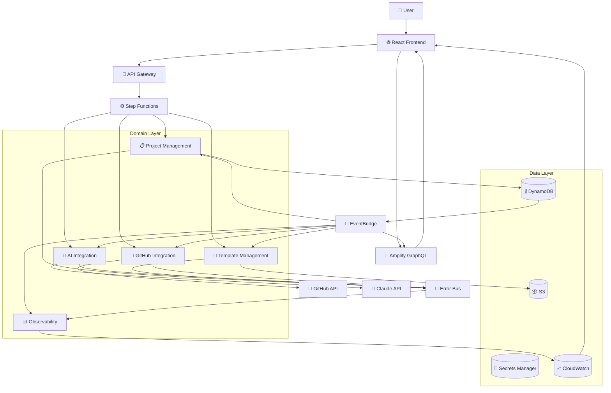
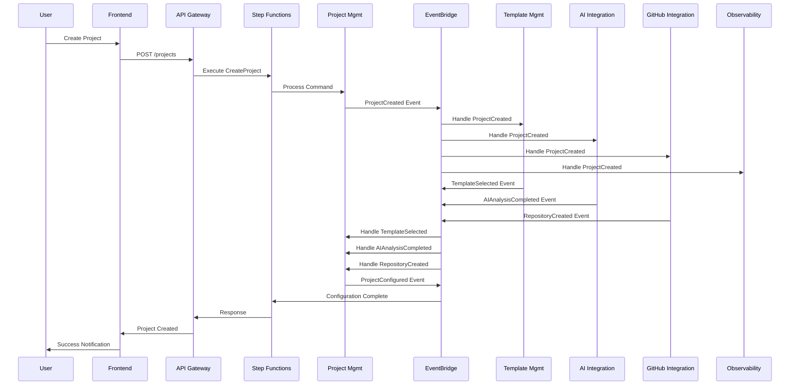
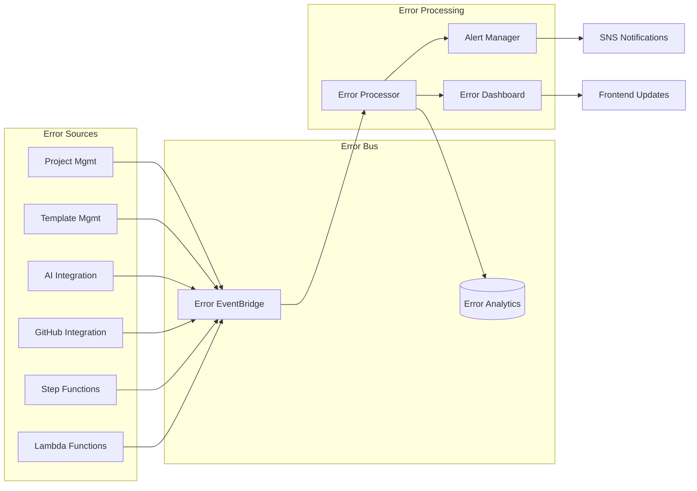
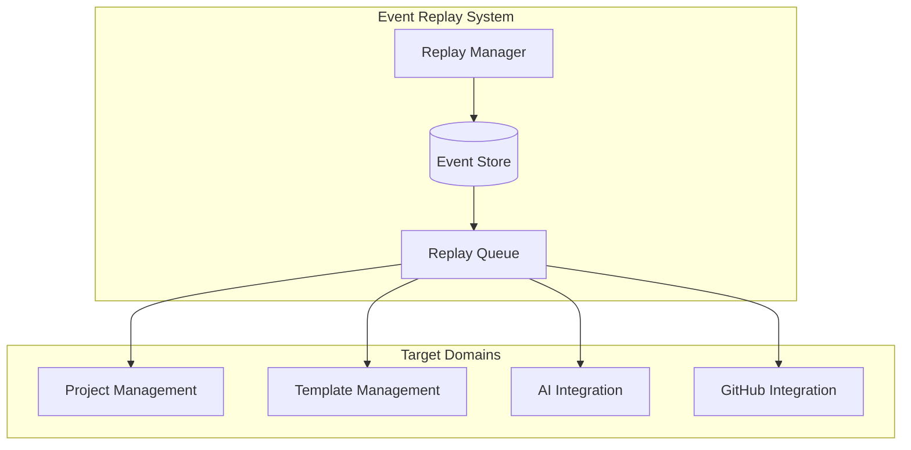

# Event Flow Architecture

## Overview

This document describes the complete event flow architecture for the Skafu microservices scaffolding application, showing how events flow between domains and external systems.

## Event Flow Patterns

### 1. Command-Event Flow Pattern

```
User Action → API Gateway → Step Functions → Command Handler → Event Store → EventBridge → Query Handlers → Frontend Update
```

### 2. Cross-Domain Event Flow

```
Domain A → EventBridge → Domain B → EventBridge → Domain C
```

### 3. Error Event Flow

```
Any Domain → Error Bus → Error Analytics → Monitoring Dashboard → Alerts
```

## Complete Event Flow Diagram



## Domain-Specific Event Flows

### Project Management Domain Events

#### Project Creation Flow
```
1. User creates project via Frontend
2. Frontend → API Gateway → CreateProject command
3. Step Functions → ProjectCreated event → EventBridge
4. EventBridge → Template Management (template selection)
5. EventBridge → AI Integration (analysis request)
6. EventBridge → GitHub Integration (repository creation)
7. EventBridge → Observability (metrics collection)
```

#### Event Sequence Diagram


### Template Management Domain Events

#### Template Processing Flow
```
1. Template uploaded to S3
2. S3 Event → Template Validation
3. TemplateValidated → EventBridge
4. EventBridge → Project Management (available templates update)
5. EventBridge → Observability (template metrics)
```

#### Event Types
- `TemplateUploaded`
- `TemplateValidated`
- `TemplateInvalidated`
- `TemplateRendered`
- `TemplateDeleted`

### AI Integration Domain Events

#### AI Analysis Flow
```
1. ProjectCreated event triggers AI analysis
2. AI Analysis → Claude API
3. Claude response → AIAnalysisCompleted event
4. EventBridge → Project Management (recommendations)
5. EventBridge → Frontend (analysis results)
```

#### Event Types
- `AIAnalysisRequested`
- `AIAnalysisCompleted`
- `CodeGenerated`
- `RecommendationGenerated`
- `AILimitReached`

### GitHub Integration Domain Events

#### Repository Creation Flow
```
1. ProjectCreated event triggers repository creation
2. GitHub API → Create repository
3. RepositoryCreated → EventBridge
4. EventBridge → Project Management (repository info)
5. EventBridge → Template Management (deploy templates)
```

#### Event Types
- `RepositoryCreated`
- `WorkflowTriggered`
- `DeploymentStarted`
- `DeploymentCompleted`
- `DeploymentFailed`

### Observability Domain Events

#### Metrics Collection Flow
```
1. All domains → Metrics events
2. Metrics aggregation → CloudWatch
3. Threshold breaches → Alarms
4. Alarms → SNS notifications
5. Dashboard updates → Frontend
```

#### Event Types
- `MetricCollected`
- `AlertTriggered`
- `DashboardUpdated`
- `ThresholdBreached`
- `SystemHealthCheck`

## Error Event Flow

### Error Bus Architecture



### Error Event Schema

```json
{
  "eventId": "uuid",
  "correlationId": "uuid",
  "timestamp": "2025-01-18T10:30:00Z",
  "source": "domain-name",
  "eventType": "ErrorOccurred",
  "severity": "ERROR|WARNING|CRITICAL",
  "data": {
    "errorCode": "VALIDATION_ERROR",
    "errorMessage": "Project name already exists",
    "context": {
      "service": "project-management",
      "function": "create-project",
      "userId": "user-123"
    },
    "stackTrace": "...",
    "canRetry": true
  }
}
```

## Event Correlation

### Correlation ID Strategy

Every event contains a correlation ID that links related events across domains:

```
User Request → correlationId: "req-12345"
├── ProjectCreated → correlationId: "req-12345"
├── TemplateSelected → correlationId: "req-12345"
├── AIAnalysisRequested → correlationId: "req-12345"
├── RepositoryCreated → correlationId: "req-12345"
└── ProjectConfigured → correlationId: "req-12345"
```

### Event Ordering

Events are ordered using timestamps and sequence numbers:

```json
{
  "timestamp": "2025-01-18T10:30:00.123Z",
  "sequenceNumber": 1,
  "eventVersion": "1.0",
  "correlationId": "req-12345"
}
```

## Event Replay and Recovery

### Event Replay Architecture



### Replay Scenarios

1. **Domain Recovery**: Replay events to rebuild domain state
2. **Feature Rollback**: Replay events to previous state
3. **Data Migration**: Replay events to new schema
4. **Testing**: Replay production events in test environment

## Performance Characteristics

### Event Processing Metrics

- **Event Latency**: < 100ms for 95th percentile
- **Event Throughput**: 10,000+ events per minute
- **Cross-Domain Latency**: < 500ms for event propagation
- **Error Processing**: < 1 second for error correlation

### Scaling Patterns

- **Auto-scaling**: EventBridge scales automatically
- **Dead Letter Queues**: Failed events for retry
- **Batch Processing**: Aggregate similar events
- **Filtering**: Reduce unnecessary event processing

## Monitoring and Observability

### Event Monitoring

```yaml
Metrics:
  - Event publication rate
  - Event processing latency
  - Cross-domain event flow
  - Error event correlation
  - Event replay success rate

Alarms:
  - High event processing latency
  - Failed event deliveries
  - Error event spikes
  - Cross-domain communication failures

Dashboards:
  - Real-time event flow visualization
  - Domain event correlation
  - Error event trends
  - System health overview
```

### Tracing

X-Ray tracing spans across:
- API Gateway requests
- Step Functions executions
- Lambda function invocations
- EventBridge event processing
- External API calls

This event flow architecture ensures loose coupling between domains while maintaining strong consistency and observability across the entire system.